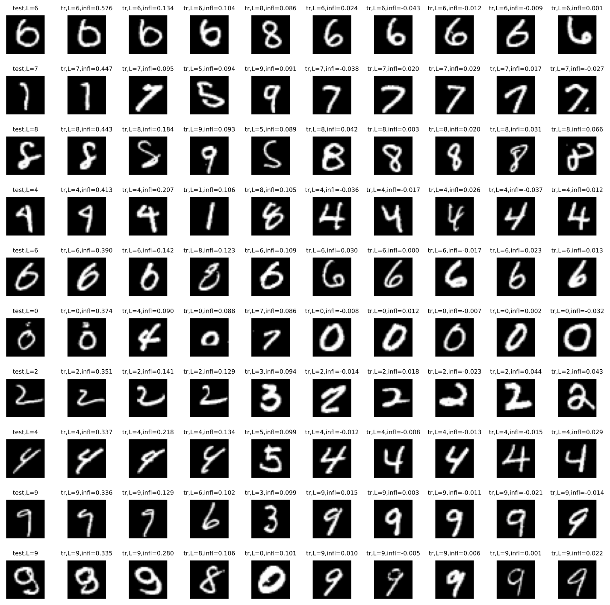

This code provide a self-contained MNIST example of influence / memorization
estimation based on training with subsets of data.
Note that MNIST is a very simple dataset, and as we noted in the paper,
there are not many examples that are memorized or have very strong
influence on test examples. We chose this dataset as demo mainly
because it is extremely cheap to train a model on it. So we can
demonstrate the entire computing pipeline that trains 2,000 models
in a simple script, which can finish in a few hours by
running sequentially on a single GPU.

The code has the following dependencies:

* Python 3
* [JAX](https://github.com/google/jax)
* [tensorflow-datasets](https://www.tensorflow.org/datasets)
* [tqdm](https://github.com/tqdm/tqdm)
* Numpy, Matplotlib

After running, it will save the computed estimation in `infl_mem.npz`,
which will be ~2.3GB as the influence estimate is a 10,000 x 60,000
matrix. It will also output a plot in `mnist-examples.pdf`, which will
look like the figure shown below: in each row, the first digit is a test
example; the next 4 digits are the training examples ranked by their
influence on this test example; the last 5 digits show 5 random training
examples belonging to the same class as the test example.

